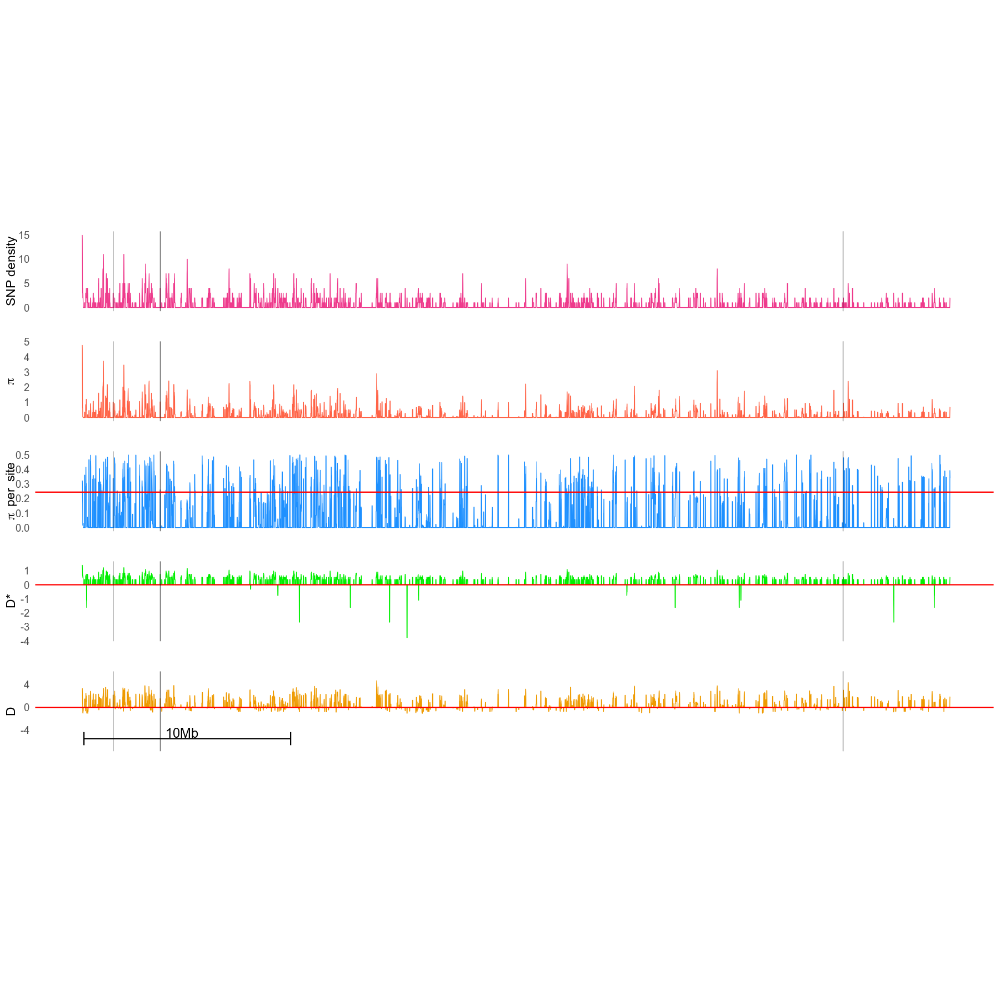

Codes for the paper : Predicting genotype environmental range from genome–environment associations
===============================================================================

**Stéphanie Manel, Marco Andrello, Karine Henry, Daphné Verdelet, Aude Darracq, Pierre‐Edouard Guerin, Bruno Desprez, Pierre Devaux**

Molecular Ecology, may 2017

_______________________________________________________________________________

This repository contains all the scripts to calculate metrics (nucleotide diversity, Tajima's D...) on the beets genome from SNP data.

These metrics were necessary to validate our approach to predict the environmental range of species genotypes from the genetic markers significantly associated with those environmental variables in an independent set of individuals. 

We applied this approach to predict aridity in a database constituted of 950 individuals of wild beets and 299 individuals of cultivated beets genotyped at 14,409 random single nucleotide polymorphisms (SNPs).

This study was funded by the French Government, under the management of the Research National Agency (ANR‐11‐BTBR‐0007) through the [AKER programme](http://www.aker-betterave.fr) in collaboration with [Florimond Desprez company](http://www.florimond-desprez.com).

_______________________________________________________________________________


# Prerequisites

## Softwares

You must install the following softwares :

* [VCFTOOLS](http://vcftools.sourceforge.net/)
* [TABIX & BGZIP](https://github.com/samtools/htslib/releases/tag/1.4.1)
* [R Version 3.2.3](https://cran.r-project.org/)
  * `R-package` ggplot2
  * `R-package` PopGenome
* [Python 2.7.12](https://www.python.org/)

## Data Files

The included data files are :

* [Positions.14409.txt](data/Positions.14409.txt): List of ID|position|scaffold|chromosome of 14409 SNPs.
* [Data.950.sauvages.txt](data/Data.950.sauvages.txt): List of names of the 950 indivuals of interest.
* [NoPool.14409.csv](data/NoPool.14409.csv): Table of genotypes of all the indivuals for the 14409 SNPs.
* [Noms.marqueurs.LFMM.gINLAnd.csv](data/Noms.marqueurs.LFMM.gINLAnd.csv): list of SNP IDs and results from Ginland & LFMM methods
* [bon_exemple.vcf](bon_exemple.vcf): Template of VCF format file used to create VCF files.


# Code sources
scripts used to calculate statistics on the genome from SNP data

## BASH scripts
* [vcf4PopGenome_protocole.sh](vcf4PopGenome_protocole.sh) : Creates VCF.GZ files using TABIX, BGZIP and VCFTOOLS for each chromosome into [mes_vcf/](mes_vcf). Uncompressed VCF files will be saved into a new [mes_vcf_save/](mes_vcf_save).
* [fabrique_outlier.sh](fabrique_outlier.sh): Generates a list of outliers SNPs positions for each chromosome into [mes_outliers/](mes_outliers).
* [add_ID_to_tables.sh](add_ID_to_tables.sh) : Creates tables with ID of SNPs into [tables/avec_id](tables/avec_id) folder from [tables/](tables) results.

## Python scripts
* [get_col.py](get_col.py): Select columns of a CSV file according to a list of colunm's names.
* [convert_data2vcf.py](convert_data2vcf.py) : Creates VCF files for each chromosome of each SNP with genotype of each indivuals.
* [get_id_snp.py](get_id_snp.py): get position|chromosome information in a table of SNP and find his ID in a VCF file.

## R scripts
* [fabrique_outlier.R](fabrique_outlier.R): From [Noms.marqueurs.LFMM.gINLAnd.csv](data/Noms.marqueurs.LFMM.gINLAnd.csv), it provides a list of outliers SNPs IDs [nom_84_outliers.txt](nom_84_outliers.txt)
* [generate_fig_tab.R](generate_fig_tab.R) : Generates sliding windows genome statistics into [figures/](figures) and [tables/](tables) folders using [mes_vcfs/](mes_vcfs) and [mes_outliers/](mes_outliers) data.
* [analysis_tables.R](analysis_tables.R)  : Basic statistical analysis on `tables/avec_id/all_stats_propre.csv`

# Workflow

## Calculate metrics (nucleotide diversity, Tajima's D...) on outliers and non-outliers SNPs and analysis

### 1. Creates VCF files of all the SNP and selected individuals
* Run [vcf4PopGenome_protocole.sh](vcf4PopGenome_protocole.sh) to create VCF.GZ files into [mes_vcf/](mes_vcf) and VCF files into [mes_vcf_save/](mes_vcf_save), using [data](data) files and [bon_exemple.vcf](bon_exemple.vcf)

```
bash vcf4PopGenome_protocole.sh
```

### 2. Get outliers SNPs and their positions
* Run [fabrique_outlier.R](fabrique_outlier.R) to create [nom_84_outliers.txt](nom_84_outliers.txt), the list of outliers SNPs IDs
* Run [fabrique_outlier.sh](fabrique_outlier.sh) to create a list of outliers SNPs positions for each chromosome into [mes_outliers/](mes_outliers)

```
bash fabrique_outlier.sh
```

### 3. Generates figures and table of genome sliding 20Kbp-windows metrics 
* Run [generate_fig_tab.R](generate_fig_tab.R) to generate plot .PDF figures into [figures/](figures) folder and .CSV tables into [tables/](tables) for each chromosome

```
Rscript generate_fig_tab.R
```


### 4. Analyse statistics on tables
* Run [add_ID_to_tables.sh](add_ID_to_tables.sh) to generate a merged table [tables/avec_id/all_stats_propre.csv](tables/avec_id/all_stats_propre.csv) with SNPs IDs and statistics of all the chromosomes from [tables/](tables) to [tables/avec_id/](tables/avec_id)
* Run [analysis_tables.R](analysis_tables.R) to have outliers SNP and non-outliers SNP statistics, then do some basic statistical tests.


```
bash add_ID_to_tables.sh
Rscript analysis_tables.R
```

# Results




* **SNP density**: number of SNPs by 20 Kbp sliding windows onto genome
* <br> $\pi$ </br>: nucleotide diversity
* **D**: Tajima D
* **D\***: Fu and Li D